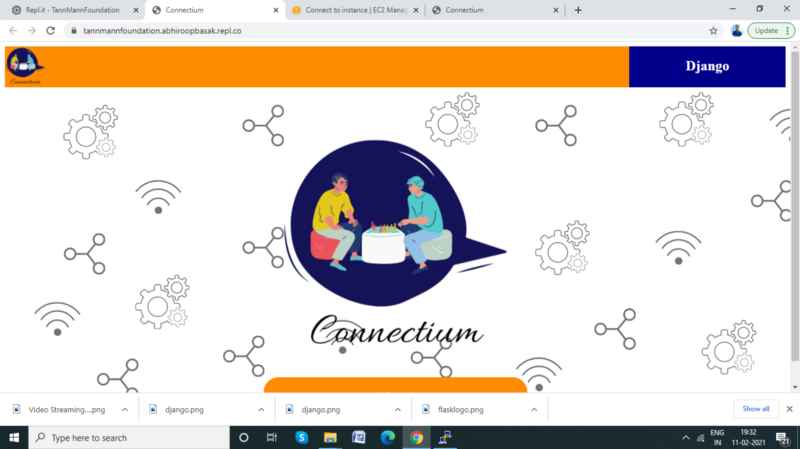
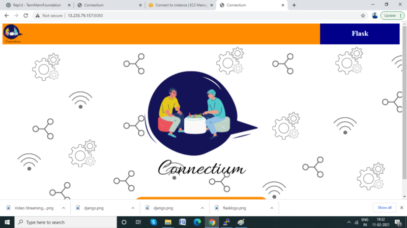
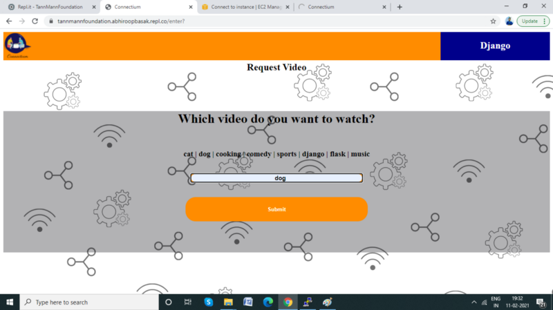
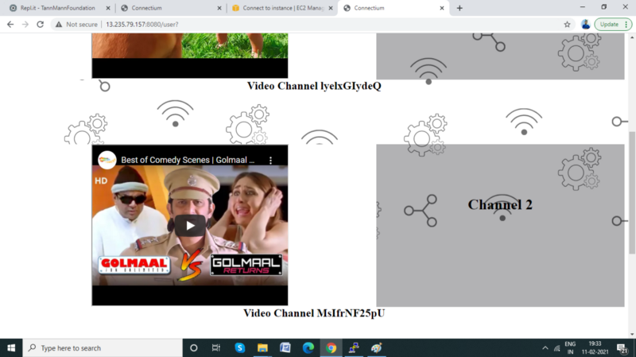

# Video Streaming on Flask-Django communication through TCP

## Technologies used

- Django

- Flask

- AWS ec2

- Socket Programming

## Code Objective

* Create 2 servers, one in django and another in flask (eg: django on 9000 port and flask on 8000 port) 

* User should be able to select a video file at flask server which is streamed to django server over websocket channels. 

* User should be able to open multiple channels to stream multiple videos simultaneously (like different chat windows)

##Code Outcome

Lets connect for collaboration!

[Linkedin](https://www.linkedin.com/in/abhiroopbasak/)
